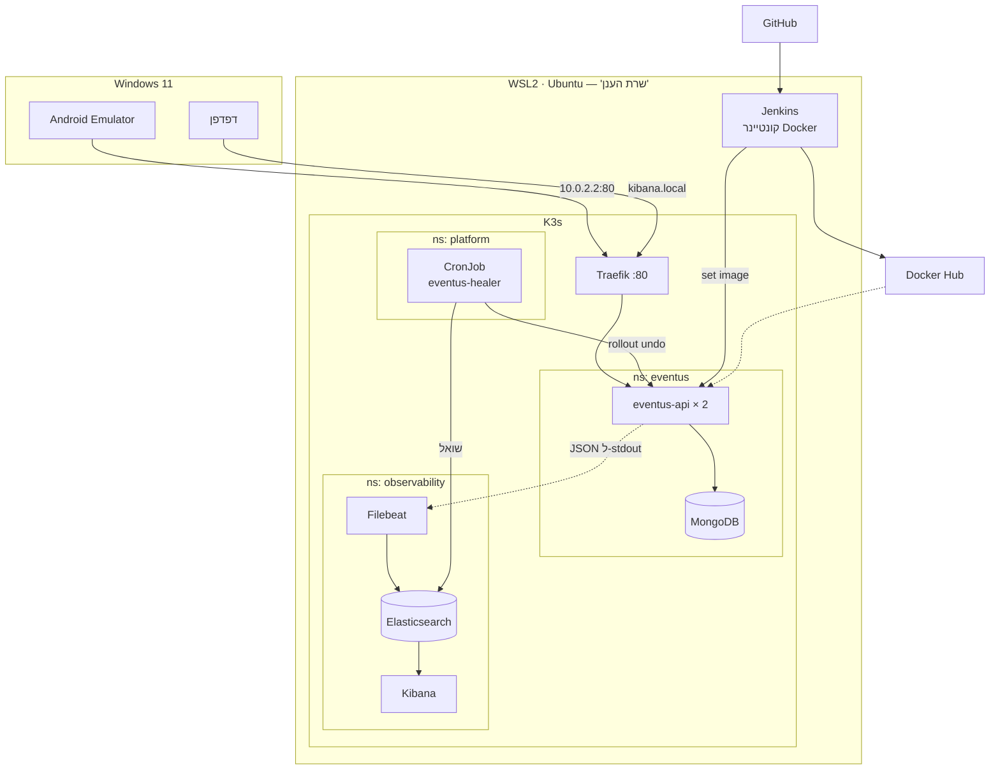
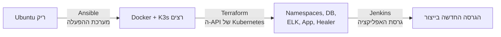
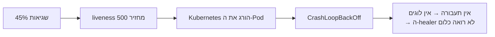
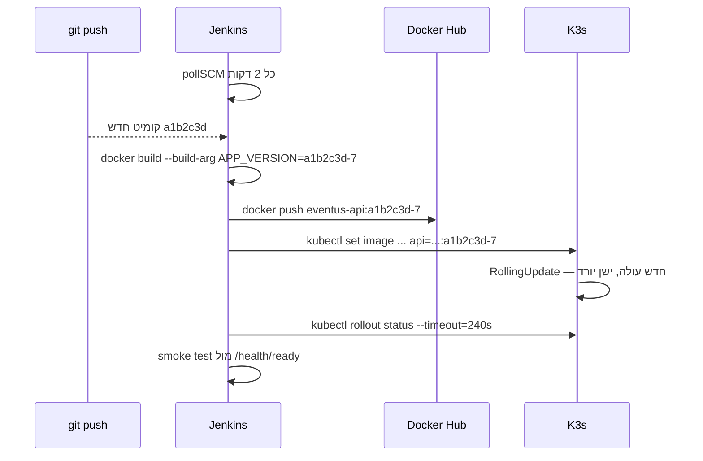
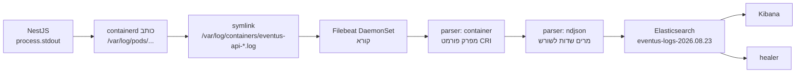
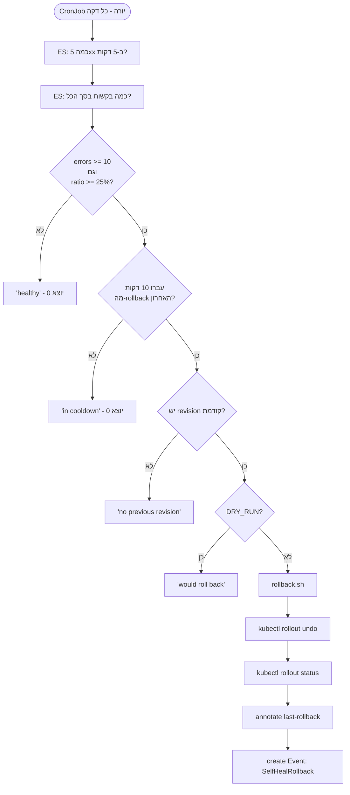

# EventUs-Dev — מדריך לימוד והצגה

**איך להבין את הפרויקט הזה לעומק ואיך להציג אותו**

---

## איך להשתמש במסמך

המסמך בנוי בשלוש רמות. אפשר לעצור אחרי כל אחת מהן.

| רמה | פרקים | מה תדע בסוף | זמן |
|---|---|---|---|
| **א. להבין** | 1–3 | מה הפרויקט עושה ולמה כל רכיב קיים | ~40 דקות |
| **ב. לשלוט** | 4–7 | איך כל שכבה עובדת, ואיך המידע זורם ביניהן | ~2 שעות |
| **ג. להציג** | 8–10 | לענות על כל שאלה ולהעביר הדגמה חיה | ~1.5 שעות |

בכל פרק טכני יש ארבעה חלקים קבועים:

> **מה זה** — הרעיון הכללי, בלי קשר לפרויקט
> **למה זה כאן** — התפקיד המדויק אצלנו
> **איך זה מוגדר** — הקוד האמיתי מהתיקייה
> **מה לומר** — המשפט שאתה אומר למרצה

---

# חלק א — להבין

## 1. הבעיה

### 1.1 מה Kubernetes כבר יודע לפתור

Kubernetes מנטר את ה-Pods שלו ומתקן שלושה סוגי תקלות לבד:

| התקלה | איך Kubernetes מזהה | מה הוא עושה |
|---|---|---|
| התהליך קרס | הקונטיינר יצא | מפעיל מחדש |
| התהליך תקוע | `livenessProbe` נכשל | הורג ומפעיל מחדש |
| התהליך לא מוכן | `readinessProbe` נכשל | מוציא מה-Service |

זה מכסה הרבה. אבל יש חור אחד גדול.

### 1.2 החור

תאר לעצמך את התקלה הבאה:

> מפתח דוחף פיצ'ר. הוא מתקמפל, הבדיקות עוברות, ה-CI ירוק. הקונטיינר עולה. `livenessProbe` עונה 200. `readinessProbe` עונה 200. `kubectl get pods` מראה `2/2 Running`.
> ובכל זאת — 45% מהמשתמשים מקבלים HTTP 500.

**Kubernetes מרוצה לחלוטין.** הוא בודק "האם התהליך מגיב", לא "האם התהליך נותן תשובות נכונות". שום מנגנון סטנדרטי לא יזהה את זה. עד שמישהו אנושי יסתכל בלוגים או יקבל תלונה — התקלה חיה.

זו התקלה הכי נפוצה בייצור אמיתי, וזה מה שהפרויקט הזה פותר.

### 1.3 הפתרון בשלוש שורות

1. האפליקציה כותבת לוג מובנה על **כל** בקשה, כולל קוד הסטטוס.
2. הלוגים נאספים ל-Elasticsearch בזמן אמת.
3. תהליך רץ כל דקה, שואל את Elasticsearch "כמה 500 היו ב-5 הדקות האחרונות ומה היחס", ואם התשובה חמורה — מריץ `kubectl rollout undo`.

זה הכל. כל שאר הפרויקט קיים כדי שהשלוש שורות האלה יוכלו לקרות.

⚠️ **המשפט שאתה פותח בו את המצגת:**
> "Kubernetes מפעיל מחדש Pod שמת. הוא לא מזהה Pod שחי, עובר את כל הבדיקות, ועונה לחצי מהבקשות ב-500. את הפער הזה בניתי."

---

## 2. מפת השטח

### 2.1 התמונה המלאה



### 2.2 מי עושה מה

| הרכיב | תפקיד במשפט אחד | מתי הוא פועל |
|---|---|---|
| **WSL2** | מספק את מכונת הלינוקס שמארחת הכל | תמיד |
| **Ansible** | הופך Ubuntu ריק למכונה עם Docker ו-K3s | פעם אחת, בהקמה |
| **Docker** | אורז את NestJS לתמונה, ומריץ את Jenkins | בכל בנייה |
| **K3s** | מריץ ומנהל את כל הקונטיינרים | תמיד |
| **Terraform** | מגדיר מה בדיוק רץ בתוך K3s | בכל שינוי תשתית |
| **Traefik** | שער הכניסה — מנתב בקשות ל-Pods | בכל בקשה |
| **MongoDB** | מסד הנתונים של האפליקציה | בכל בקשה שנוגעת בנתונים |
| **Jenkins** | בונה, דוחף ופורס גרסה חדשה | בכל `git push` |
| **Filebeat** | קורא לוגים מהדיסק ושולח ל-Elasticsearch | תמיד |
| **Elasticsearch** | שומר את הלוגים ומאפשר חיפוש | תמיד |
| **Kibana** | מציג את הלוגים ויזואלית | כשמסתכלים |
| **Python + Bash** | מזהה גל שגיאות ומחזיר גרסה | כל דקה |

### 2.3 שלוש ההפרדות שנותנות לזה מבנה

זה הרעיון שהופך את הפרויקט מ"ערימת כלים" למערכת.



| הכלי | שולט על | לא נוגע ב |
|---|---|---|
| **Ansible** | חבילות, שירותי systemd, פרמטרי ליבה | שום דבר בתוך Kubernetes |
| **Terraform** | משאבי Kubernetes: namespaces, Deployments, Services | מערכת ההפעלה, ותג ה-image |
| **Jenkins** | תג ה-image של האפליקציה בלבד | כל שאר המבנה |

⚠️ **המשפט:**
> "Ansible עובד מול מערכת ההפעלה, Terraform עובד מול ה-API של Kubernetes, ו-Jenkins נוגע רק בתג התמונה. אם מערבבים — מקבלים כלי אחד שעושה הכל גרוע."

---

### 2.4 כל הפרויקט — 16 קבצים

זה כל מה שנוסף לריפו. אם תזכור את הטבלה הזו, אתה יודע איפה נמצא כל דבר.

| קובץ | שורות | מה הוא עושה |
|---|---|---|
| `infra/ansible/inventory.ini` | 2 | על איזו מכונה עובדים |
| `infra/ansible/site.yml` | 143 | Docker + K3s + kubectl + terraform על Ubuntu ריק |
| `infra/terraform/providers.tf` | 14 | גרסת ה-provider והנתיב ל-kubeconfig |
| `infra/terraform/variables.tf` | 26 | 4 משתנים, כולל הדחייה של `:latest` |
| `infra/terraform/terraform.tfvars.example` | 3 | תבנית לסודות |
| `infra/terraform/main.tf` | 808 | **כל 30 המשאבים באשכול** |
| `infra/healer/healer.py` | 125 | קורא את Elasticsearch ומחליט אם לגלגל אחורה |
| `infra/healer/rollback.sh` | 28 | מבצע את הגלגול ומתעד אותו |
| `infra/healer/Dockerfile` | 19 | Alpine + Python + kubectl, ~75MB |
| `infra/jenkins/Dockerfile` | 32 | Jenkins + docker CLI + kubectl + תוספים |
| `backend/event-us/src/common/platform.ts` | 98 | לוגר, שני middleware, ובקר הבריאות וה-chaos |
| `backend/event-us/Dockerfile` | 35 | multi-stage, non-root |
| `backend/event-us/.dockerignore` | 13 | |
| `Jenkinsfile` | 81 | checkout → build → push → deploy → smoke → rollback |
| `eventus.sh` | 185 | **כל פעולות התפעול** — 8 תת-פקודות |
| `DEVOPS.md` | 62 | ה-README של חלק ה-DevOps |
| **סה"כ** | **1,674** | |

בנוסף נערכו 3 קבצי TypeScript קיימים (`main.ts`, `app.module.ts`, `user.controller.ts`), 7 קבצי שירותים נוקו מ-`console.log`, ו-4 קבצים באנדרואיד (שורה אחת בכל אחד משני קבצי Java, `build.gradle.kts`, וקונפיג הרשת).

**למה זה חשוב להצגה:** המספר הזה הוא טענה על השליטה שלך בפרויקט, לא רק על היקפו. הגרסה הראשונה של אותה מערכת בדיוק עמדה על 45 קבצים ו-2,931 שורות — במבנה "מסודר" עם `roles/` ב-Ansible וקובץ נפרד לכל תחום ב-Terraform. אחרי שבדקתי מה כל פיצול קונה בפועל, איחדתי:

- **Terraform** ממילא קורא את כל קבצי ה-`.tf` בתיקייה ומאחד אותם לגרף אחד. הפיצול היה ויזואלי בלבד.
- **role ב-Ansible** הוא יחידת שימוש חוזר. עם playbook אחד, אין שימוש חוזר.
- **שבעה סקריפטים** שכולם מגדירים מחדש את אותם משתני סביבה → תת-פקודות בקובץ אחד.
- **חמישה קבצי TypeScript** באורך 18–56 שורות שחולקים שלושה קבועים → קובץ אחד.

הרצתי את כל חבילת הבדיקות מחדש אחרי האיחוד: אותן תוצאות בדיוק. **אותה תבנית חשיבה שהובילה להורדת Nginx ו-Logstash.**

---

## 3. ההחלטות שמגדירות את הפרויקט

אלה השאלות שהמרצה ישאל, אז שווה לדעת אותן לפני שהוא שואל.

### 3.1 למה אין Nginx

**המרצה כבר אמר את זה.** התכנון המקורי כלל Nginx כ-Ingress Controller. הוא ציין ש-K3s כבר מגיע עם Traefik.

**מה עשינו:** הורדנו את Nginx לגמרי.

**ההסבר המלא:**

Ingress Controller צריך לעשות דבר אחד — לקבל בקשת HTTP מבחוץ ולנתב אותה ל-Service הנכון לפי ה-host או ה-path. Traefik עושה בדיוק את זה, הוא כבר מותקן ומוגדר ב-K3s, והוא כבר מאזין על פורט 80. הוספת Nginx הייתה מוסיפה קונטיינר, קובץ קונפיגורציה, ונקודת כשל — בלי יכולת אחת שאין כבר.

**ההוכחה שזה מספיק** — שני Ingress שונים חיים יחד בלי התנגשות:

```hcl
# האפליקציה — בלי host, תופס הכל
rule {
  http { path { path = "/" ... } }
}

# Kibana — עם host
rule {
  host = "kibana.local"
  http { path { path = "/" ... } }
}
```

Traefik מחשב עדיפות לפי אורך הכלל. `Host(kibana.local) && PathPrefix(/)` ארוך יותר מ-`PathPrefix(/)`, ולכן זוכה כשה-Host תואם. כל השאר נופל ל-catch-all של האפליקציה.

⚠️ **המשפט:**
> "המרצה שאל למה Nginx אם יש Traefik. הצדק איתו, והורדתי אותו. באותו קו הורדתי גם את Logstash. שני רכיבים פחות, אותה פונקציונליות."

### 3.2 למה אין Logstash

ה-ELK הקלאסי הוא Elasticsearch + **L**ogstash + Kibana. Logstash קיים כדי לקחת שורת טקסט חופשי כמו:

```
2026-08-23 10:15:02 ERROR GET /events/search returned 500 in 3ms
```

ולהפוך אותה לשדות שאפשר לחפש. זה ה-parsing.

**מה עשינו במקום:** שינינו את NestJS כך שיפלוט מלכתחילה:

```json
{"time":"2026-08-23T10:15:02.331Z","level":"error","service":"eventus-api","version":"a1b2c3d","msg":"GET /events/search 500","method":"GET","path":"/events/search","statusCode":500,"durationMs":3.02,"ip":"10.42.0.1"}
```

כשהמקור כבר JSON — אין מה לפרסר. Filebeat קורא, מפענח, ושולח ישירות ל-Elasticsearch.

**מה חסכנו:** רכיב, קונטיינר, ~1GB זיכרון, ונקודת כשל.

⚠️ **המשפט:**
> "Logstash קיים כדי להפוך טקסט חופשי לשדות. אני פולט JSON מובנה מהאפליקציה, אז הוא מיותר. זה גם משנה את הדיון: במקום להתאמץ לפרסר לוגים אחרי המעשה, עיצבתי את הלוג להיות מובנה מלכתחילה."

### 3.3 למה Jenkins מחוץ לאשכול

Jenkins צריך להריץ `docker build`. אם Jenkins עצמו רץ כ-Pod בתוך Kubernetes, אין לו גישה ל-Docker daemon — צריך Docker-in-Docker (מצריך privileged) או Kaniko (עוד כלי ללמוד).

מחוץ לאשכול, כקונטיינר על ה-Docker של WSL, הוא מקבל את `/var/run/docker.sock` ישירות ואת ה-kubeconfig כדי לפרוס פנימה. פשוט, ומשקף ארגונים אמיתיים שבהם ה-CI חי מחוץ לאשכול היעד.

⚠️ **הצד השני, שכדאי להזכיר לפני שהמרצה יזכיר:**
> "מי שיכול לדבר עם `docker.sock` יכול להריץ קונטיינר עם `-v /:/host` ולקבל root על המארח. בסביבת ייצור הייתי משתמש ב-Kaniko שבונה תמונות בתוך Pod בלי daemon."

### 3.4 למה תג ייחודי לכל בנייה

זה נראה כמו פרט טכני. זה תנאי הכרחי לכל הפרויקט.

```groovy
env.IMAGE_TAG = "${env.GIT_SHA}-${env.BUILD_NUMBER}"
```

**מה קורה עם `latest`:** Jenkins בונה `eventus-api:latest` ודוחף. `kubectl set image` מקבל את אותה מחרוזת שכבר מוגדרת — Kubernetes לא רואה שינוי ולא עושה rollout. ואם כן, `rollout undo` יחזיר ל... `latest`. אותה תמונה בדיוק.

**עם תג ייחודי:** `a1b2c3d-6` → `f4e9a1c-7`. Kubernetes רואה שינוי אמיתי, יוצר ReplicaSet חדש, ו-`rollout undo` מחזיר ל-`a1b2c3d-6` — תמונה אחרת פיזית.

זה כל כך קריטי שהוספתי אכיפה ב-Terraform:

```hcl
validation {
  condition     = can(regex("^[^:]+:[^:]+$", var.app_image)) && !endswith(var.app_image, ":latest")
  error_message = "app_image must carry an explicit tag and must not be :latest, otherwise rollout undo cannot swap images."
}
```

### 3.5 למה שני תנאים לריפוי, ולא אחד

```python
if errors < THRESHOLD or ratio < MIN_ERROR_RATIO:
    log('info', 'healthy, no action')
    return 0
```

| התנאי | מה קורה בלעדיו |
|---|---|
| `errors >= 10` | בשעה 3 לפנות בוקר יש 2 בקשות. אחת נכשלת. יחס = 50%. **rollback מיותר.** |
| `ratio >= 25%` | בשעת עומס יש 50,000 בקשות. 15 נכשלות. זה 0.03% — רעש רגיל. **rollback מיותר.** |

רק שניהם יחד נותנים החלטה יציבה: **גם הרבה שגיאות, וגם חלק משמעותי מהתעבורה.**

⚠️ **המשפט:**
> "מערכת שמחליטה על סמך מספר מוחלט בלבד תעשה rollback מיותר בעומס. מערכת שמחליטה על סמך יחס בלבד תעשה rollback על שגיאה אחת מתוך שתיים בלילה. השילוב הוא מה שהופך את זה להחלטה ולא לרפלקס."

### 3.6 למה נקודות הבריאות מוחרגות מה-chaos

זו ההחלטה שהכי קל לפספס, והיא לב העניין.

```typescript
const EXEMPT = ['/health/live', '/health/ready'];
```

אם ה-probes היו מקבלים גם הם 500:



Kubernetes היה פותר את זה לבד — בכך שיהרוג את ה-Pod — ואז לא היינו מדגימים כלום. **אנחנו רוצים במפורש Pod חי שמחזיר שגיאות**, כי זה בדיוק המצב שהכלים הסטנדרטיים לא תופסים.

⚠️ **המשפט (וזו נקודה שמרשימה):**
> "החרגתי את ה-probes בכוונה. אילו הן היו נכשלות, Kubernetes היה הורג את ה-Pod והבעיה הייתה נפתרת לבד — וזה בדיוק לא התרחיש שאני מדגים. אני מדגים את המקרה שבו כל הכלים הסטנדרטיים מרוצים והמערכת שבורה."


---

# חלק ב — לשלוט

## 4. שכבה אחר שכבה

### 4.1 WSL2 — "השרת"

> **מה זה**
> Windows Subsystem for Linux 2 הוא לינוקס אמיתי שרץ במכונה וירטואלית קלה בתוך Windows, עם ליבת Linux מלאה.

> **למה זה כאן**
> K3s דורש לינוקס — cgroups, systemd, iptables. WSL2 נותן את זה בלי VM כבד ובלי dual boot.

> **איך זה מוגדר**

`C:\Users\galh2\.wslconfig`:

```ini
[wsl2]
memory=10GB
processors=6
networkingMode=mirrored
```

`/etc/wsl.conf` בתוך הדיסטרו:

```ini
[boot]
systemd=true
```

`/etc/sysctl.d/99-eventus.conf`:

```
vm.max_map_count=262144
```

**שלוש נקודות שכדאי להבין:**

| ההגדרה | למה |
|---|---|
| `systemd=true` | K3s רץ כשירות systemd. בלי זה — אין אשכול. |
| `networkingMode=mirrored` | WSL משקף את ממשקי הרשת של Windows. שירות שמאזין ב-WSL על :80 נגיש מיד ב-`localhost:80` של Windows, ולכן ב-`10.0.2.2:80` מהאמולטור. בלי זה צריך port forwarding ידני וה-IP משתנה בכל אתחול. |
| `vm.max_map_count=262144` | Elasticsearch דורש את זה. עם הערך הנמוך של ברירת המחדל הוא נופל בעלייה. |

> **מה לומר**
> "בחרתי WSL2 ולא VM כי האמולטור של אנדרואיד פונה ל-`10.0.2.2` שהוא ה-loopback של המארח. עם mirrored networking פורט 80 ב-WSL הוא פורט 80 ב-Windows, אז האמולטור מגיע ישר ל-Ingress בלי הגדרות ביניים."

---

### 4.2 Ansible — הכנת הברזל

> **מה זה**
> כלי Configuration Management. כותבים מצב רצוי ב-YAML, והוא מביא את המכונה למצב הזה. אידמפוטנטי — הרצה שנייה לא משנה כלום.

> **למה זה כאן**
> להפוך Ubuntu ריק למכונה עם Docker ו-K3s. הוא **לא** יוצר namespaces או פורס אפליקציות — זה תפקיד Terraform.

> **איך זה מוגדר**

```
infra/ansible/
├── inventory.ini    wsl-node ansible_connection=local
└── site.yml         playbook יחיד, 19 משימות:
                       חבילות בסיס · sysctl (vm.max_map_count)
                       Docker (repo רשמי, התקנה, קבוצה)
                       K3s (גרסה מקובעת, המתנה שהצומת מוכן)
                       kubectl + terraform + KUBECONFIG ב-bashrc
```

**למה אין `roles/`:** role הוא יחידת שימוש חוזר בין playbooks. יש playbook אחד ושרת אחד — אין שימוש חוזר. אם המרצה ישאל, זו התשובה.

הלב של תפקיד ה-k3s:

```yaml
- name: Install the k3s server
  ansible.builtin.command: /tmp/k3s-install.sh
  environment:
    INSTALL_K3S_VERSION: "{{ k3s_version }}"
    INSTALL_K3S_EXEC: >-
      server
      --write-kubeconfig-mode 644
      --node-name eventus-node
      --kubelet-arg=eviction-hard=imagefs.available<2%,nodefs.available<2%
```

| הדגל | למה |
|---|---|
| `INSTALL_K3S_VERSION` מקובע | IaC חייב להיות שחזיר. הרצה בעוד חודש = אותה תוצאה. |
| `--write-kubeconfig-mode 644` | בלעדיו הקובץ הוא `600 root:root` ו-Terraform מקבל permission denied. |
| `--node-name eventus-node` | ב-WSL ה-hostname משתנה. שם קבוע מייצב `kubectl wait`. |
| `eviction-hard=...<2%` | kubelet רואה את דיסק C: כולו. אם הוא מלא ב-88%, Kubernetes זורק Pods עם `DiskPressure` בלי סיבה. |

⚠️ **שים לב מה **אין** שם: `--disable=traefik`.** מדריכים רבים באינטרנט מבטלים את Traefik. אצלנו הוא ה-Ingress.

**איכות הקוד:** עובר `ansible-lint` בפרופיל **production** — הפרופיל המחמיר ביותר — עם אפס אזהרות.

> **מה לומר**
> "ה-inventory אומר `ansible_connection=local` כי השרת הוא אותה מכונה. אילו זה היה שרת מרוחק הייתי משנה שורה אחת ל-IP ומפתח SSH — הקוד עצמו לא היה משתנה כלל. זו כל הנקודה של Ansible."

---

### 4.3 Docker — האריזה

> **מה זה**
> אורז אפליקציה עם כל התלויות שלה לתמונה שרצה זהה בכל מקום.

> **למה זה כאן**
> Kubernetes מריץ קונטיינרים. בלי תמונה אין מה לפרוס.

> **איך זה מוגדר**

```dockerfile
FROM node:22-alpine AS builder
WORKDIR /app
COPY package.json package-lock.json ./
RUN npm ci
COPY tsconfig.json tsconfig.build.json nest-cli.json ./
COPY src ./src
RUN npm run build

FROM node:22-alpine AS runtime
ENV NODE_ENV=production
WORKDIR /app
RUN addgroup -S eventus && adduser -S eventus -G eventus
COPY package.json package-lock.json ./
RUN npm ci --omit=dev && npm cache clean --force
COPY --from=builder /app/dist ./dist
USER eventus
ARG APP_VERSION=dev
ENV APP_VERSION=${APP_VERSION}
EXPOSE 3000
CMD ["node", "dist/main.js"]
```

**ארבע החלטות ששווה להסביר:**

| ההחלטה | הנימוק | המספר |
|---|---|---|
| Multi-stage | שלב הבנייה מכיל TypeScript ו-CLI. שלב הריצה מקבל רק `dist/` | 481 חבילות מול **146** |
| `npm ci` ולא `install` | מציית ל-lockfile בדיוק, בנייה דטרמיניסטית | — |
| `package*.json` לפני `src` | שכבת מטמון — שינוי קוד לא מפיל את שכבת ההתקנה | בנייה שנייה בשניות |
| `USER eventus` | לא רץ כ-root | נאכף גם ב-K8s עם `runAsNonRoot` |

> **מה לומר**
> "הפרדתי לשני שלבים. התמונה הסופית לא מכילה את מהדר ה-TypeScript ולא את ה-CLI של Nest — 146 חבילות במקום 481. וזה לא רק גודל: כל חבילה שלא נמצאת בתמונת ה-production היא גם משטח תקיפה שלא קיים."

---

### 4.4 K3s — האורקסטרטור

> **מה זה**
> הפצת Kubernetes קלה בבינארי אחד. כולל את כל ה-Kubernetes האמיתי, אבל עם ברירות מחדל שמתאימות לצומת אחד.

> **למה זה כאן**
> הוא מריץ את הקונטיינרים, מפעיל מחדש מה שנופל, מנתב תעבורה, ומנהל אחסון.

> **מה K3s מביא מובנה**

| הרכיב | תפקיד |
|---|---|
| **Traefik** | Ingress Controller |
| **CoreDNS** | DNS פנימי — `mongodb.eventus.svc.cluster.local` |
| **local-path-provisioner** | יוצר PersistentVolumes מהדיסק המקומי |
| **metrics-server** | `kubectl top` |
| **containerd** | ה-runtime שמריץ קונטיינרים |

> **המושגים שאתה חייב לדעת**

| המושג | במשפט אחד | אצלנו |
|---|---|---|
| **Pod** | היחידה הקטנה ביותר — קונטיינר אחד או יותר שחולקים רשת | `eventus-api-7d4f...` |
| **Deployment** | מנהל Pods זהים, מטפל ב-rolling update ובהיסטוריה | `eventus-api` עם 2 replicas |
| **ReplicaSet** | נוצר על ידי Deployment, מחזיק גרסה אחת. **כאן שמורה ההיסטוריה** | חדש בכל שינוי image |
| **Service** | כתובת יציבה שמאזנת עומס בין Pods | `eventus-api:3000` |
| **Ingress** | כלל ניתוב מבחוץ פנימה | `/` → `eventus-api:3000` |
| **StatefulSet** | כמו Deployment, אבל עם זהות ואחסון קבועים | MongoDB, Elasticsearch |
| **DaemonSet** | Pod אחד בכל צומת | Filebeat |
| **CronJob** | מריץ Job לפי לוח זמנים | ה-healer, כל דקה |
| **ConfigMap / Secret** | קונפיגורציה / סודות | `eventus-api-config`, `mongodb-credentials` |
| **Namespace** | חלוקה לוגית | `eventus`, `observability`, `platform` |

⚠️ **ReplicaSet היא הנקודה שהמרצה עשוי לבחון.** `rollout undo` עובד בזכותו: ה-Deployment שומר את N ה-ReplicaSets האחרונים (אצלנו `revisionHistoryLimit = 5`), וכל אחד מהם מחזיק את מפרט ה-Pod של גרסה אחת. `undo` פשוט מעתיק חזרה את המפרט מה-ReplicaSet הקודם.

> **מה לומר**
> "בחרתי K3s ולא Kubernetes מלא כי זה בינארי אחד עם צריכת זיכרון של כמה מאות מגה, והוא Kubernetes מוסמך — אותו API בדיוק. כל מה שכתבתי כאן עובד ללא שינוי על EKS או GKE."

---

### 4.5 Terraform — התשתית כקוד

> **מה זה**
> מגדירים משאבים ב-HCL, Terraform משווה מול המצב בפועל ומביא את העולם למצב הרצוי. הוא זוכר מה יצר ב-state file.

> **למה זה כאן**
> כדי שכל מה שרץ באשכול יהיה קוד בגיט, ולא רצף פקודות `kubectl` שאף אחד לא זוכר.

> **איך זה מוגדר** — 4 קבצים, 30 משאבים, 851 שורות

```
infra/terraform/
├── providers.tf              provider ~> 2.38, נתיב kubeconfig
├── variables.tf              4 משתנים, אחד עם validation
├── terraform.tfvars.example
└── main.tf                   30 משאבים + 3 outputs:
       locals + 3 namespaces
       MongoDB          Secret + Headless Service + StatefulSet + PVC
       האפליקציה         ConfigMap + Deployment + Service + Ingress
       Elasticsearch    Service + StatefulSet + init-container
       Kibana           Service + Deployment + Ingress
       Filebeat         SA + ClusterRole + Binding + ConfigMap + DaemonSet
       ריפוי עצמי        SA + Role + RoleBinding + ConfigMap + CronJob
       Jenkins RBAC     SA + token Secret + Role + RoleBinding
```

**למה קובץ אחד ולא שמונה:** Terraform קורא את כל קבצי ה-`.tf` בתיקייה ומאחד אותם לגרף תלויות אחד. סדר הביצוע נגזר מהקשרים בין המשאבים — לא משמות הקבצים. הקידומות `01-`, `02-` היו מטעות, כי הן רומזות על סדר שלא קיים.

> **ההחלטה החשובה ביותר בקובץ הזה**

```hcl
lifecycle {
  ignore_changes = [
    spec[0].template[0].spec[0].container[0].image,
    metadata[0].annotations,
  ]
}
```

**הבעיה שזה פותר, בשלושה צעדים:**

1. Terraform יוצר את ה-Deployment עם `app_image = "galhillel/eventus-api:seed"`.
2. Jenkins מריץ `kubectl set image ... api=galhillel/eventus-api:f4e9a1c-7`.
3. אתה מריץ `terraform plan` → הוא רואה `seed` בקוד ו-`f4e9a1c-7` באשכול, ומציע **להחזיר את הישן**.

בלי `ignore_changes`, ה-`apply` הבא היה מוחק את הפריסה של Jenkins ומחזיר גרסה ישנה. עם זה — Terraform מתעלם משדה ה-image לגמרי.

⚠️ **`metadata[0].annotations` מכסה את כולם במכה אחת** — `deployment.kubernetes.io/revision` ש-Kubernetes כותב, `kubernetes.io/change-cause` ש-Jenkins כותב, ו-`eventus.io/last-rollback` שה-healer כותב. בלעדיו Terraform היה מוחק את היסטוריית סיבות הפריסה ואת חותמת ה-cooldown בכל apply.

> **שלוש נקודות טכניות ששווה להכיר**

**א. `_v1` בשמות המשאבים.** כתבתי `kubernetes_deployment_v1` ולא `kubernetes_deployment`. הגרסה 3.0 של ה-provider הוציאה משימוש את השמות בלי הסיומת. הקוד עובד גם ב-2.x וגם ב-3.x.

**ב. `%%{` בקונפיג של Filebeat.**

```hcl
index = "${var.log_index_prefix}-%%{+yyyy.MM.dd}"
```

הרצף `%{` הוא הוראת תבנית ב-HCL. כדי לקבל `%{` מילולי צריך `%%{`. בלי זה `terraform validate` נכשל.

**ג. `init_container` ב-Elasticsearch.**

```hcl
init_container {
  name    = "fix-permissions"
  image   = "busybox:1.36"
  command = ["sh", "-c", "chown -R 1000:1000 /usr/share/elasticsearch/data"]
  security_context { run_as_user = 0 }
}
```

ה-PVC נוצר בבעלות root, ES רץ כמשתמש 1000. בלי התיקון: `AccessDeniedException`. זו התקלה מספר אחת בהרצת Elasticsearch ב-Kubernetes.

> **מה לומר**
> "Terraform מגדיר את המבנה, Jenkins מגדיר את הגרסה. `ignore_changes` על שדה ה-image הוא מה שמונע מהם להילחם. זו בעיית ה-drift הקלאסית כשמשלבים IaC עם CD, והפתרון הוא ארבע שורות."

---

### 4.6 Traefik — שער הכניסה

> **מה זה**
> Reverse proxy שקורא את ה-Ingress objects מ-Kubernetes ומגדיר את עצמו לפיהם, בזמן אמת.

> **למה זה כאן**
> נקודת הכניסה היחידה. האמולטור והדפדפן מגיעים אליו ב-`:80`, והוא מנתב פנימה.

> **איך זה מוגדר**

```hcl
resource "kubernetes_ingress_v1" "eventus_api" {
  metadata {
    annotations = {
      "traefik.ingress.kubernetes.io/router.entrypoints" = "web"
    }
  }
  spec {
    ingress_class_name = "traefik"
    rule {
      http {
        path {
          path      = "/"
          path_type = "Prefix"
          backend { service { name = "eventus-api"; port { number = 3000 } } }
        }
      }
    }
  }
}
```

⚠️ **אין `host` בכלל הזה — וזה מכוון.** האמולטור שולח `Host: 10.0.2.2`, הדפדפן שולח `Host: localhost`, ו-Jenkins בודק דרך `Host: localhost` גם כן. כלל בלי host תופס את שלושתם.

> **מה לומר**
> "Traefik קורא את אובייקטי ה-Ingress ישירות מ-Kubernetes ומעדכן את עצמו. לא צריך לכתוב קונפיג ולא לעשות reload — יוצרים Ingress, והניתוב חי תוך שניות."

---

### 4.7 Jenkins — צינור ה-CI/CD

> **מה זה**
> שרת אוטומציה. מזהה שינוי ב-Git ומריץ רצף שלבים מוגדר.

> **איך זה מוגדר** — `Jenkinsfile`, 6 שלבים



| השלב | מה קורה |
|---|---|
| Checkout | מושך את הקוד, מחשב `IMAGE_TAG = <sha>-<build>` |
| Build image | `docker build` עם `APP_VERSION` מוזרק |
| Push image | `docker login --password-stdin`, push, `docker logout` |
| Deploy to K3s | `kubectl set image` + `annotate change-cause` + `rollout status` |
| Smoke test | לולאה של עד 12 ניסיונות מול `/health/ready` דרך ה-Ingress |
| Report | מציג pods ו-`rollout history` |

> **הרשאות — נקודה למצגת**

Jenkins לא מקבל את ה-kubeconfig של האדמין. הוא מקבל ServiceAccount ייעודי:

```hcl
rule {
  api_groups = ["apps"]
  resources  = ["deployments"]
  verbs      = ["get", "list", "watch", "patch", "update"]
}
```

אין `delete`. אין secrets. אין namespace אחר. ההוכחה:

```
$ kubectl auth can-i patch deployments  -n eventus   →  yes
$ kubectl auth can-i delete deployments -n eventus   →  no
$ kubectl auth can-i get secrets        -n eventus   →  no
$ kubectl auth can-i get pods           -n kube-system → no
```

⚠️ **צלם את הפלט הזה למצגת.** `yes / no / no / no` היא ההוכחה החזותית לעקרון ההרשאה המזערית.

> **מה לומר**
> "התג הוא `<git-sha>-<build-number>`. ה-SHA מקשר את התמונה לקוד המדויק, מספר הבנייה מבטיח ייחודיות. בלי תג ייחודי `rollout undo` לא מחליף תמונה בפועל, ואז כל מנגנון הריפוי הוא תיאטרון."

---

### 4.8 ELK — שכבת התצפית

> **מה זה**
> Elasticsearch שומר ומחפש. Filebeat אוסף ושולח. Kibana מציג.

> **איך זה עובד אצלנו, צעד אחר צעד**



**קונפיג ה-Filebeat, החלק הקריטי:**

```yaml
filebeat.inputs:
  - type: filestream
    id: eventus-api
    prospector.scanner.symlinks: true
    paths:
      - /var/log/containers/eventus-api-*.log
    parsers:
      - container: { stream: all, format: auto }
      - ndjson: { target: "", overwrite_keys: true, add_error_key: true }
```

| השורה | למה היא שם |
|---|---|
| `prospector.scanner.symlinks: true` | ⚠️ הקבצים ב-`/var/log/containers/` הם **symlinks** ל-`/var/log/pods/`. בלי הדגל הזה Filebeat מתעלם מהם ולא שולח כלום. התקלה השקטה הכי מתסכלת. |
| `paths: eventus-api-*.log` | סינון ברמת הקובץ. בלעדיו Filebeat היה שולח גם את הלוגים של Elasticsearch עצמו — ל-Elasticsearch. לולאה שממלאת את הדיסק. |
| `parser: container` | מפרק את פורמט CRI: `2026-08-23T09:00:00Z stdout F {json}` ומוציא את התוכן |
| `parser: ndjson` | מפרק את ה-JSON ומרים את `statusCode`, `level`, `version` לשורש המסמך |
| **הסדר בין השניים** | ⚠️ הפוך את הסדר ותקבל שדה `message` עם טקסט במקום שדות לחיפוש |

> **מה לומר**
> "האפליקציה כותבת ל-stdout. containerd אוסף לדיסק. Filebeat רץ כ-DaemonSet ומעביר ל-Elasticsearch. שים לב שהאפליקציה לא יודעת שקיים Elasticsearch — היא רק כותבת JSON למסך. זה מה שהופך את השכבה הזו להחלפה: אפשר להחליף את ES ב-Loki בלי לגעת בשורת קוד אחת באפליקציה."

---

### 4.9 מנגנון הריפוי

> **הזרימה המלאה**



> **חמש נקודות בקוד ששווה להכיר**

**א. `service.keyword` ולא `service`**

```python
{'term': {'service.keyword': SERVICE}}
```

Elasticsearch ממפה מחרוזת לשני שדות: `service` מסוג `text` (מפורק לטוקנים) ו-`service.keyword` מסוג `keyword` (הערך השלם). שאילתת `term` על `service` מחפשת התאמה מדויקת לטוקן — ו-`eventus-api` מפורק ל-`eventus` ול-`api`, ולכן **לא נמצא כלום**. זו התקלה השקטה הנפוצה ביותר ב-Elasticsearch.

**ב. `exists: statusCode` לספירת המכנה**

```python
total = count([{'exists': {'field': 'statusCode'}}])
```

סופר רק שורות של בקשות HTTP. שורת `server started` אין לה `statusCode` ולא מזייפת את היחס.

**ג. Python מחליט, Bash מבצע**

```python
result = subprocess.run(['bash', ROLLBACK_SCRIPT, NAMESPACE, DEPLOYMENT, reason], ...)
```

זו לא הפרדה מלאכותית — האפיון דרש את שניהם, וההפרדה גם נכונה מבחינה הנדסית: הלוגיקה של ההחלטה בפייתון, פעולת התיקון בבאש.

**ד. סדר הפעולות ב-`rollback.sh`**

```bash
kubectl rollout undo "deployment/${DEPLOYMENT}"
kubectl rollout status "deployment/${DEPLOYMENT}" --timeout=180s
kubectl annotate "deployment/${DEPLOYMENT}" "eventus.io/last-rollback=${NOW}" --overwrite
```

חותמת ה-cooldown נכתבת **אחרי** ש-`rollout status` הצליח. אילו נכתבה לפני והחזרה נכשלה, היינו נכנסים ל-cooldown של 10 דקות בלי שהמערכת התאוששה.

**ה. RBAC חוצה-namespace**

ה-ServiceAccount יושב ב-`platform`. ה-Role וה-RoleBinding יושבים ב-`eventus`:

```hcl
resource "kubernetes_role_binding_v1" "healer" {
  metadata { namespace = "eventus" }
  role_ref { kind = "Role"; name = "eventus-healer" }
  subject {
    kind      = "ServiceAccount"
    name      = "eventus-healer"
    namespace = "platform"
  }
}
```

⚠️ **הכלל:** ה-RoleBinding תמיד יושב ב-namespace שבו נמצא **המשאב**, ומצביע על ServiceAccount שיכול לחיות ב-namespace אחר.

⚠️ ה-Role כולל `replicasets` עם `get, list, watch`. **בלעדיהם `rollout undo` נכשל** — ההיסטוריה מאוחסנת ב-ReplicaSets, לא ב-Deployment.

> **מה לומר**
> "המנגנון נכשל לצד הבטוח. אם Elasticsearch לא זמין הוא רושם את זה ויוצא בלי לגעת באשכול. אם אין revision קודמת הוא אומר את זה ולא מנסה. אם ה-RBAC דוחה — הוא רושם ולא מתעקש. עדיף לא לעשות כלום מאשר לפעול על סמך מידע חסר."


---

## 5. שלושה מסעות דרך המערכת

הדרך הכי טובה להוכיח שאתה מבין מערכת היא לתאר מסע של דבר אחד דרכה.

### 5.1 מסע של בקשה אחת

המשתמש לוחץ "חפש אירועים" באמולטור.

| # | איפה | מה קורה |
|---|---|---|
| 1 | Android | `Database.searchEvents()` → `AsyncHttpRequest` בונה `BuildConfig.API_BASE_URL + "events/search"` = `http://10.0.2.2/events/search?name=Wedding` |
| 2 | האמולטור | `10.0.2.2` הוא alias קבוע ל-loopback של המארח → `localhost:80` ב-Windows |
| 3 | WSL | mirrored networking מעביר לפורט 80 בתוך WSL |
| 4 | K3s | `svclb-traefik` תופס hostPort 80 ומעביר ל-Pod של Traefik |
| 5 | Traefik | קורא `Host: 10.0.2.2`, לא מוצא כלל host ספציפי, נופל ל-catch-all `PathPrefix(/)` → `eventus-api:3000` |
| 6 | Service | ClusterIP מאזן round-robin בין שני ה-Pods **המוכנים** |
| 7 | ה-Pod | `requestLogMiddleware` מתחיל למדוד ורושם `res.on('finish')` |
| 8 | ה-Pod | `chaosMiddleware` בודק `CHAOS_ERROR_RATE` — 0 בייצור, אז ממשיך |
| 9 | NestJS | `EventController.searchEvent()` → `EventService.search_event()` |
| 10 | Mongoose | שאילתה ל-`mongodb.eventus.svc.cluster.local:27017` דרך CoreDNS |
| 11 | MongoDB | מחזיר תוצאות מה-PVC |
| 12 | ה-Pod | תשובה 200 חוזרת. `res.on('finish')` יורה |
| 13 | stdout | `{"time":"...","level":"info","statusCode":200,"path":"/events/search","durationMs":12.4,...}` |
| 14 | containerd | כותב ל-`/var/log/pods/eventus_eventus-api-.../api/0.log` |
| 15 | Filebeat | קורא דרך ה-symlink, מפרק CRI, מפרק JSON, שולח |
| 16 | Elasticsearch | נכנס לאינדקס `eventus-logs-2026.08.23` |
| 17 | Kibana / healer | רואים את השורה |

⚠️ **הזמן הכולל משלב 1 עד 12: מילישניות. משלב 13 עד 16: עד 10 שניות.** הפער הזה חשוב — הוא הסיבה שחלון החיפוש של ה-healer הוא 5 דקות ולא 30 שניות.

### 5.2 מסע של קומיט אחד

| # | מה קורה |
|---|---|
| 1 | `git push origin devops-project` |
| 2 | תוך עד 2 דקות `pollSCM` מזהה SHA חדש |
| 3 | **Checkout** — `IMAGE_TAG = f4e9a1c-7` |
| 4 | **Build** — `docker build --build-arg APP_VERSION=f4e9a1c-7`. שכבת `npm ci` באה מהמטמון |
| 5 | **Push** — `docker push galhillel/eventus-api:f4e9a1c-7` |
| 6 | **Deploy** — `kubectl set image deployment/eventus-api api=...:f4e9a1c-7` |
| 7 | Kubernetes יוצר **ReplicaSet חדש** ומתחיל rolling update |
| 8 | `maxSurge=1` → Pod שלישי עולה. `maxUnavailable=0` → שני הישנים ממשיכים לשרת |
| 9 | ה-Pod החדש: `startupProbe` (עד 120 שניות), ואז `readinessProbe` |
| 10 | ברגע ש-Ready ועברו `minReadySeconds=5` — נכנס ל-Service, ואחד הישנים מקבל SIGTERM |
| 11 | חוזר על עצמו ל-Pod השני |
| 12 | `kubectl rollout status` חוזר בהצלחה |
| 13 | **Smoke test** — `curl /health/ready` דרך ה-Ingress עד 200 |
| 14 | `change-cause` נרשם, ההיסטוריה קריאה |

⚠️ **באפליקציה באנדרואיד לא רואים כלום.** `maxUnavailable=0` מבטיח שבשום רגע אין פחות משני Pods מוכנים.

### 5.3 מסע של תקלה אחת

| דקה | מה קורה |
|---|---|
| 0:00 | קומיט משנה `DEFAULT_ERROR_RATE` מ-0 ל-0.45 |
| 0:00–2:00 | Jenkins תופס, בונה, דוחף |
| 2:00–3:00 | פורס. **ה-Smoke test עובר** — `/health/ready` מוחרג מה-chaos |
| 3:00 | 45% מהבקשות מקבלות 500. `kubectl get pods` מראה `2/2 Running` |
| 3:00–3:10 | Filebeat מעביר את השגיאות ל-Elasticsearch |
| 3:10 | בקיבנה: "Server Errors" קופץ, ועמודה חדשה מופיעה ב-"Errors by version" |
| ≤4:00 | ה-CronJob יורה. `errors=87, total=168, ratio=0.52` — שני התנאים נחצו |
| 4:00 | בודק cooldown → אין. בודק revisions → יש 7 |
| 4:00 | `rollback.sh`: `rollout undo` → `rollout status` → `annotate` → `create Event` |
| 4:30 | ה-Pods חזרו לתמונה הקודמת. השגיאות נעצרות |
| 5:00 | הבקשה הבאה של ה-CronJob: `errors=12` (שאריות בחלון) — אבל cooldown פעיל |
| 9:00 | החלון של 5 דקות התנקה. `errors=0` |
| 14:00 | ה-cooldown פג. המערכת חוזרת לכוננות מלאה |

⚠️ **שים לב לחפיפה בין החלון (5 דקות) ל-cooldown (10 דקות).** זה מכוון: עד שה-cooldown נגמר, השגיאות של הגרסה השבורה כבר יצאו מחלון החיפוש. בלי היחס הזה המנגנון היה יכול להיכנס ללולאת rollback.

---

## 6. הקוד הקריטי — שורה אחר שורה

### 6.1 `requestLog` — ב-`platform.ts`

```typescript
export function requestLog(req: Request, res: Response, next: NextFunction) {
  const start = process.hrtime.bigint();
  res.on('finish', () => {
    const path = req.originalUrl.split('?')[0];
    const code = res.statusCode;
    const level = code >= 500 ? 'error' : code >= 400 ? 'warn' : 'info';
    log(level, `${req.method} ${path} ${code}`, {
      method: req.method,
      path,
      statusCode: code,
      durationMs: Math.round(Number(process.hrtime.bigint() - start) / 1e4) / 100,
      ip: req.ip,
    });
  });
  next();
}
```

| שורה | למה |
|---|---|
| `process.hrtime.bigint()` | שעון מונוטוני ברזולוציית ננו-שניות. `Date.now()` יכול לקפוץ אחורה בסנכרון NTP. |
| `res.on('finish')` | יורה כשהתשובה נשלחה במלואה. **רק אז** `res.statusCode` סופי. |
| `req.originalUrl.split('?')[0]` | ⚠️ מסיר את ה-query string. ה-Login שולח סיסמה שם. |
| `statusCode` כמספר | Elasticsearch ימפה ל-`long` ואפשר יהיה `>= 500`. כמחרוזת — לא. |
| מיפוי רמות | 5xx→error, 4xx→warn, 2xx→info. מאפשר סינון בקיבנה לפי `level`. |
| `next()` **מחוץ** ל-callback | ה-middleware לא חוסם. הוא רק נרשם ומעביר הלאה. |

### 6.2 `chaos` — והבאג שהיה כאן

```typescript
export function chaos(req: Request, res: Response, next: NextFunction) {
  const rate = Number.parseFloat(process.env.CHAOS_ERROR_RATE ?? String(DEFAULT_ERROR_RATE));
  const path = req.originalUrl.split('?')[0];
  if (!rate || HEALTH_PATHS.includes(path) || Math.random() >= rate) {
    next();
    return;
  }
  res.status(500).json({ statusCode: 500, message: 'Internal Server Error', error: 'chaos' });
}
```

⚠️ **`req.originalUrl` בשורה השנייה הוא תיקון לבאג אמיתי שנמצא בבדיקות.**

הגרסה המקורית השתמשה ב-`req.path`. כש-NestJS מרכיב middleware עם `forRoutes('*')`, Express מרכיב אותו על התבנית `'*'` — ואז:

```json
{"req.path":"/", "req.baseUrl":"/health/live", "req.originalUrl":"/health/live?x=1"}
```

`req.path` הוא **תמיד `/`**. הבדיקה `HEALTH_PATHS.includes('/')` תמיד שקרית, וה-chaos חל גם על נקודות הבריאות. התוצאה בבדיקה:

```
health/live x20 : 200 200 200 200 500 500 500 200 500 ...
```

**למה זה היה הורס את הדמו:** `livenessProbe` היה נכשל, Kubernetes היה הורג את ה-Pod, ומקבלים `CrashLoopBackOff`. אין תעבורה, אין לוגים, ה-healer לא רואה כלום. התרחיש שלנו — Pod חי שמחזיר שגיאות — היה הופך לתרחיש ש-Kubernetes פותר לבד.

**אחרי התיקון:** 130 בקשות לנקודות הבריאות, 130 תשובות 200. ובנתיב עסקי: 400 בקשות, שיעור שגיאות 0.407 מול יעד 0.400 (z = +0.31).

⚠️ **זה סיפור מצוין למצגת.** הוא מראה שבדקת ולא רק כתבת.

### 6.3 `PlatformController` — נקודות הבריאות

```typescript
@Get('live')
live() {
  return { status: 'ok', uptime: Math.round(process.uptime()) };
}

@Get('ready')
ready() {
  const state = this.connection.readyState;
  if (state !== 1) {
    throw new ServiceUnavailableException({ status: 'not-ready', mongo: state });
  }
  return { status: 'ok', mongo: 'connected', version: process.env.APP_VERSION || 'dev' };
}
```

| | `liveness` | `readiness` |
|---|---|---|
| השאלה | "התהליך תקוע?" | "אפשר לשלוח לך תעבורה?" |
| כשנכשל | Kubernetes **הורג ומפעיל מחדש** | Kubernetes **מוציא מה-Service** |
| בודק | רק שהתהליך מגיב | גם שיש חיבור ל-Mongo |

`connection.readyState` מ-Mongoose: `0=disconnected, 1=connected, 2=connecting, 3=disconnecting`.

**אומת בפועל:** כשהרגתי את מסד הנתונים, `/health/ready` עבר ל-503 עם `{"status":"not-ready","mongo":0}` תוך כ-10 שניות, בעוד `/health/live` נשאר 200. כשהמסד חזר — `/health/ready` חזר ל-200 לבד.

⚠️ **זו ההפרדה שגורמת ל-rolling update לעבוד:** Pod חדש שעדיין לא התחבר ל-Mongo לא מקבל תעבורה, אבל גם לא נהרג באמצע ההתחברות.

### 6.4 `healer.py` — לב ההחלטה

```python
errors = count([{'range': {'statusCode': {'gte': 500}}}])
total  = count([{'exists': {'field': 'statusCode'}}])
ratio  = (errors / total) if total else 0.0

if errors < THRESHOLD or ratio < MIN_ERROR_RATIO:
    log('info', 'healthy, no action')
    return 0

elapsed = minutes_since_last_rollback()
if elapsed is not None and elapsed < COOLDOWN_MINUTES:
    log('warn', 'threshold breached but still in cooldown', ...)
    return 0

if revision_count() < 2:
    log('error', 'threshold breached but there is no previous revision to roll back to')
    return 0
```

| השורה | למה |
|---|---|
| `if total else 0.0` | מונע חלוקה באפס כשאין תעבורה בכלל |
| `errors < THRESHOLD or ratio < MIN` | **שני התנאים.** `or` על התנאי ההפוך = `and` על התנאי החיובי |
| `elapsed is not None and ...` | `None` פירושו "מעולם לא היה rollback" — לא cooldown |
| `revision_count() < 2` | בלי revision קודמת `rollout undo` נכשל. עדיף לרשום מפורשות |
| כל היציאות `return 0` | Job שנכשל היה מייצר רעש. אלה מצבים תקינים, לא כשלים |

---

# חלק ג — להציג

## 7. תסריט ההצגה

### 7.1 סידור המסך

| חלון | תוכן |
|---|---|
| שמאל | אמולטור אנדרואיד |
| מרכז, טאב 1 | Kibana — הדשבורד, refresh כל 5 שניות |
| מרכז, טאב 2 | Jenkins |
| ימין עליון | טרמינל עם `./eventus.sh traffic` רץ |
| ימין תחתון | טרמינל פנוי |

### 7.2 הרצף

| דקות | השלב | מה עושים | מה אומרים |
|---|---|---|---|
| 0–2 | ארכיטקטורה | שקף הדיאגרמה + טבלת ההחלטות | "לקחתי את פרויקט הגמר שלי מהתואר והקמתי סביבו פלטפורמה שלמה. **התחלתי עם Nginx בתכנון והורדתי אותו — K3s כבר מגיע עם Traefik.** באותו קו הורדתי גם את Logstash." |
| 2–4 | המערכת חיה | `./eventus.sh status` · באמולטור: התחברות וגלילה · `./eventus.sh traffic` | "שני Pods, מסד נתונים, ELK, ו-CronJob. הכל ירוק, ואפס שגיאות בקיבנה." |
| 4–6 | מכניסים באג | `./eventus.sh break` | "אני משנה שורה אחת ודוחף. שים לב להודעת הקומיט — 'feat: new caching layer'. ככה זה נראה במציאות; אף אחד לא כותב 'שובר את הייצור'." |
| 6–10 | Jenkins | לעקוב אחרי השלבים | "**ה-Smoke test עובר.** הוא בודק `/health/ready`, וה-endpoint הזה מוחרג מהבאג בכוונה — כי זה בדיוק המצב שאני מדגים: תקלה שעוברת את כל בדיקות ה-CI ואת כל ה-probes של Kubernetes." |
| 10–11 | הקריסה | טרמינל התעבורה נצבע אדום · באמולטור: שגיאות · בקיבנה: המספר קופץ | "Kubernetes מרוצה לגמרי. `kubectl get pods` מראה 2/2 Running. שום probe לא נכשל. רק ELK יודע שיש בעיה." |
| 11–13 | הריפוי | `kubectl -n platform get jobs -w` ואז `logs` | "שני התנאים נבדקו: 87 שגיאות — מעל הסף של 10, ו-52% מהבקשות — מעל הסף של 25%. אילו היו 87 שגיאות מתוך 100,000 בקשות, המערכת לא הייתה נוגעת בכלום." |
| 13–14 | חזרה לשגרה | תעבורה ירוקה · `rollout history` · `get events` | "המערכת זיהתה לבד תקלה שאף כלי סטנדרטי לא זיהה, החליטה לפי שני תנאים כמותיים, תיקנה, ותיעדה ב-Kubernetes Events. הכל תוך פחות מדקה, בלי שנגעתי במקלדת." |
| 14+ | שאלות | `./eventus.sh reset` ברקע | |

### 7.3 ההוכחות שמראים בסוף

```bash
kubectl -n eventus rollout history deployment/eventus-api
```

```
REVISION  CHANGE-CAUSE
5         build 6 commit a1b2c3d
7         build 7 commit f4e9a1c
8         self-heal rollback: 87 server errors out of 168 requests in the last 5m
```

```bash
kubectl -n eventus get events --field-selector reason=SelfHealRollback
kubectl auth can-i delete deployments --as=system:serviceaccount:eventus:jenkins-deployer -n eventus
```

### 7.4 תוכניות גיבוי

| מה נשבר | מה עושים |
|---|---|
| Jenkins לא תופס את ה-push | **Build Now** ידני. "זה polling כל 2 דקות, אני מזרז." |
| ה-healer לא מזהה בזמן | `kubectl -n platform create job manual --from=cronjob/eventus-healer`. "אני מזרז את התזמון כדי לא לבזבז את זמנכם." |
| Kibana לא נטענת | `kubectl -n observability port-forward svc/kibana 5601:5601` |
| האמולטור לא מתחבר | `curl http://localhost/health/ready` מ-Windows. אם עובד — בעיית אמולטור, ממשיכים עם curl |
| WSL קורס | `wsl --shutdown` ואז `wsl -d Ubuntu-24.04`. הכל עולה לבד תוך ~90 שניות |
| הכל נשבר | **הקלטת וידאו של ריצה מוצלחת, מוכנה מראש** |

⚠️ הקלטת גיבוי היא ניהול סיכונים, לא חוסר ביטחון. הקלט ריצה מלאה יום לפני.

## 8. שאלות ותשובות

### ארכיטקטורה

**ש: למה לא Nginx?**
ת: K3s מגיע עם Traefik מותקן ומוגדר, והוא מנתב לפי host ולפי path — כל מה שהתרחיש דורש. Nginx היה מוסיף קונטיינר, קונפיג ונקודת כשל בלי יכולת חדשה. בפרויקט יש שני Ingress — האפליקציה ללא host כ-catch-all, ו-Kibana עם `kibana.local` — והם חיים יחד בלי התנגשות כי Traefik מחשב עדיפות לפי אורך הכלל.

**ש: למה ויתרת על Logstash?**
ת: Logstash הופך טקסט חופשי לשדות. שיניתי את NestJS לפלוט JSON מובנה, אז אין מה להפוך. Filebeat מפענח ושולח ישירות. חסכתי רכיב ו-כ-1GB זיכרון.

**ש: למה K3s ולא Kubernetes מלא?**
ת: K3s הוא Kubernetes מוסמך — אותו API בדיוק — בבינארי אחד עם צריכת זיכרון נמוכה משמעותית. כל מה שכתבתי עובד ללא שינוי על EKS או GKE.

**ש: למה שלושה namespaces?**
ת: בידוד. מחיקה בטעות של `observability` לא מפילה את האפליקציה. בנוסף ה-`ResourceQuota` על `eventus` מגביל ל-12 Pods ו-4GB — אם באג יגרום להתנפחות, Kubernetes עוצר במקום להפיל את WSL.

**ש: למה Jenkins מחוץ לאשכול?**
ת: הוא צריך לבנות תמונות Docker. בתוך Kubernetes זה דורש DinD או Kaniko. מבחוץ הוא מקבל את `docker.sock` ישירות. הצד השני הוא שגישה ל-socket שקולה ל-root על המארח — בייצור הייתי עובר ל-Kaniko.

### Terraform

**ש: איך Terraform ו-Jenkins לא נלחמים על אותו Deployment?**
ת: `lifecycle { ignore_changes = [...] }` על שדה ה-image ועל ה-annotations. Terraform מגדיר מבנה, Jenkins מגדיר גרסה, ה-healer כותב חותמת cooldown. בלי זה כל `terraform plan` היה מציע להחזיר את התג הישן.

**ש: למה ה-state מקומי?**
ת: פרויקט של אדם אחד. בצוות זה היה חייב backend מרוחק עם נעילה — S3+DynamoDB או Terraform Cloud — כי שני `apply` במקביל משחיתים state מקומי. ה-state לא נכנס ל-Git כי הוא מכיל את סיסמת Mongo בטקסט גלוי.

**ש: מה זה `_v1` בשמות המשאבים?**
ת: גרסה 3.0 של ה-provider הוציאה משימוש את השמות בלי סיומת גרסה. כתיבה עם `_v1` עובדת גם ב-2.x וגם ב-3.x.

### Kubernetes

**ש: איך `rollout undo` יודע לאן לחזור?**
ת: כל שינוי ב-template יוצר ReplicaSet חדש, וה-Deployment שומר את 5 האחרונים (`revisionHistoryLimit`). `undo` מעתיק את המפרט מה-ReplicaSet הקודם. זו הסיבה שה-Role של ה-healer כולל `replicasets` — בלעדיו הפקודה נכשלת.

**ש: למה `maxUnavailable: 0`?**
ת: כדי שהפריסה תהיה בלי downtime. Kubernetes מעלה Pod חדש, מחכה שיהיה Ready, ורק אז מוריד ישן. בדמו רואים את זה — האפליקציה באנדרואיד לא מרגישה בפריסה.

**ש: מה ההבדל בין liveness ל-readiness אצלך?**
ת: liveness שואל "התהליך תקוע" ובודק רק שהשרת מגיב. readiness שואל "אפשר לשלוח תעבורה" ובודק גם את החיבור ל-Mongo. כשהרגתי את מסד הנתונים בבדיקה, readiness עבר ל-503 ו-liveness נשאר 200 — כלומר Kubernetes הוציא את ה-Pod מה-Service אבל לא הרג אותו, וכשהמסד חזר הוא חזר לשירות לבד.

**ש: למה יש גם `startupProbe`?**
ת: עלייה ראשונה יכולה לקחת עד 120 שניות אם Mongo עדיין מתאתחל. ה-startupProbe נותן את הזמן הזה, ורק אחריו ה-liveness מקבל שליטה. בלעדיו ה-liveness היה הורג את ה-Pod באמצע האתחול.

### הריפוי העצמי

**ש: מה קורה אם ה-healer עושה rollback בטעות?**
ת: שני תנאים במקביל — מספר מוחלט ויחס. בנוסף cooldown של 10 דקות, בדיקה שקיימת revision קודמת, ומצב `DRY_RUN` שמאפשר להריץ בתצפית לפני שמפעילים.

**ש: מה אם Elasticsearch נופל?**
ת: הוא רושם `elasticsearch unreachable`, יוצא בקוד 1 ולא נוגע באשכול. בדקתי את זה במפורש. כשל שקט לצד הבטוח — עדיף לא לעשות כלום מאשר rollback על סמך מידע חסר.

**ש: למה CronJob ולא לולאה?**
ת: CronJob הוא הפרימיטיב הנכון — Kubernetes מנהל תזמון, היסטוריה, כשלונות וניקוי. `concurrencyPolicy: Forbid` מונע ריצות חופפות, ו-`ttlSecondsAfterFinished` מנקה Jobs ישנים. תהליך `while true` היה דורש ממני לכתוב את כל זה.

**ש: איך אתה מונע ממנו לזהות שגיאות של הגרסה שכבר הוחזרה?**
ת: חלון החיפוש הוא 5 דקות וה-cooldown 10 דקות. עד שה-cooldown נגמר, השגיאות הישנות כבר יצאו מהחלון. ה-aggregation לפי `version` מאשר את זה בלוג — רואים בדיוק איזו גרסה ייצרה את השגיאות.

**ש: למה `service.keyword` ולא `service`?**
ת: Elasticsearch ממפה מחרוזת גם ל-`text` (מפורק לטוקנים) וגם ל-`keyword` (ערך שלם). `term` על השדה המפורק מחפש טוקן, ו-`eventus-api` מפורק ל-`eventus` ול-`api` — אז לא נמצא כלום. זו התקלה השקטה הנפוצה ביותר ב-Elasticsearch.

### אבטחה

**ש: למה `xpack.security` כבוי?**
ת: החלטה מודעת של סביבת מעבדה. ES 8 היה דורש יצירת CA, אישורים ו-Secrets לכל רכיב. פורט 9200 לא חשוף מחוץ לאשכול ואין לו Ingress. בייצור הייתי מפעיל, כנראה עם ECK שמנהל את האישורים.

**ש: איזה הרשאות יש ל-Jenkins?**
ת: ServiceAccount ייעודי עם Role ב-namespace אחד. `patch` ו-`update` על deployments, קריאה של pods ולוגים. אין `delete`, אין secrets, אין `kube-system`. אפשר לראות את זה עם `kubectl auth can-i`.

**ש: מצאת בעיות אבטחה בקוד המקורי?**
ת: כן, שתיים. מחרוזת חיבור ל-MongoDB Atlas עם סיסמה בקוד ובהיסטוריית Git — הוצאתי ל-Secret של Kubernetes והשבתי את המשתמש ב-Atlas. ובנוסף, ה-Login הוא `GET` עם הסיסמה ב-query string, ולכן ה-middleware שלי חותך את ה-query מהנתיב לפני הכתיבה ללוג. בלי זה כל סיסמה הייתה נכתבת ל-Elasticsearch בטקסט גלוי.

**ש: מה בדקת בקוד התשתית מבחינת אבטחה?**
ת: הרצתי סורק אבטחה סטטי על קוד ה-Terraform. הוא מצא שלושה דברים אמיתיים — ל-Kibana חסרו security context ו-liveness probe, וחסרה חסימת NET_RAW — ותיקנתי את שלושתם. קונטיינר האפליקציה רץ עם `allow_privilege_escalation = false` ו-`capabilities.drop = ["ALL"]`. יתר הממצאים היו החלטות מודעות, למשל `imagePullPolicy: IfNotPresent`, שנכון כאן דווקא בגלל שכל תג ייחודי.

### כללי

**ש: מה למדת מזה?**
ת: שהחלק הקשה הוא לא לחבר כלים אלא להחליט מה **לא** להכניס. הורדתי Nginx ו-Logstash, ובכל פעם המערכת נעשתה טובה יותר. ושבדיקה שווה יותר מקריאה — הבאג המשמעותי ביותר בפרויקט נראה נכון לגמרי בקוד והתגלה רק כשהרצתי 20 בקשות ובדקתי את הקודים.

**ש: מה היית עושה אחרת בייצור?**
ת: ארבעה דברים. Kaniko במקום `docker.sock`. Remote state עם נעילה. GitOps — ArgoCD שמושך במקום Jenkins שדוחף, כדי שה-credential של האשכול לא ישב אצל ה-CI. ו-Prometheus + Alertmanager לצד ELK, כך שה-healer יגיב ל-alert במקום לתשאל את ES בעצמו.

**ש: כמה זה עולה?**
ת: אפס. הכל רץ על המחשב שלי. Docker Hub בחינם לתמונות ציבוריות.

## 9. מונחון

| מונח | פירוש |
|---|---|
| **Ansible** | ניהול תצורה של מערכת הפעלה דרך YAML |
| **Chaos Engineering** | הזרקת תקלות מכוונת כדי לוודא שהמערכת מתמודדת |
| **ClusterIP** | סוג Service — כתובת פנימית בלבד |
| **containerd** | מנוע הקונטיינרים ש-K3s משתמש בו |
| **CronJob** | משאב Kubernetes שמריץ Job לפי לוח זמנים |
| **DaemonSet** | Pod אחד בכל צומת |
| **Deployment** | מנהל Pods זהים, rolling update והיסטוריה |
| **DaemonSet vs Deployment** | הראשון לפי צומת, השני לפי מספר עותקים |
| **Drift** | פער בין המצב בקוד למצב בפועל |
| **Elasticsearch** | מנוע חיפוש ואחסון מסמכים |
| **Filebeat** | סוכן קל שקורא קבצי לוג ושולח |
| **Headless Service** | Service עם `clusterIP: None` — DNS מחזיר IP של Pod |
| **HCL** | שפת התצורה של Terraform |
| **Idempotent** | הרצה חוזרת נותנת אותה תוצאה |
| **Ingress** | כלל ניתוב HTTP מבחוץ פנימה |
| **K3s** | הפצת Kubernetes קלה בבינארי אחד |
| **Kibana** | ממשק ויזואלי ל-Elasticsearch |
| **kubeconfig** | קובץ עם כתובת האשכול והרשאות |
| **Liveness probe** | בדיקה "התהליך תקוע" |
| **NDJSON** | Newline-Delimited JSON — אובייקט JSON אחד בכל שורה |
| **Namespace** | חלוקה לוגית של האשכול |
| **PVC** | PersistentVolumeClaim — בקשת אחסון קבוע |
| **Pod** | היחידה הקטנה ביותר ב-Kubernetes |
| **RBAC** | Role-Based Access Control |
| **Readiness probe** | בדיקה "אפשר לשלוח תעבורה" |
| **ReplicaSet** | מחזיק גרסה אחת של Pods. **כאן שמורה ההיסטוריה** |
| **Rolling update** | החלפת Pods הדרגתית בלי downtime |
| **Secret** | אובייקט Kubernetes לנתונים רגישים |
| **ServiceAccount** | זהות של תהליך מול ה-API של Kubernetes |
| **StatefulSet** | כמו Deployment, עם זהות ואחסון קבועים |
| **Terraform** | תשתית כקוד מול APIs |
| **Traefik** | Ingress Controller שמגיע עם K3s |
| **WSL2** | לינוקס אמיתי בתוך Windows |

---

## 10. תרגיל בדיקה עצמית

אם אתה יכול לענות על אלה בלי להסתכל — אתה מוכן.

1. תאר את המסע של בקשה מהאמולטור עד לשורה ב-Elasticsearch. כמה שכבות?
2. למה `rollout undo` לא היה עובד עם תג `latest`?
3. מה בדיוק שמור ב-ReplicaSet, ולמה ה-healer צריך הרשאת `list` עליו?
4. למה נקודות הבריאות מוחרגות מה-chaos? מה היה קורה בלעדי ההחרגה?
5. מה עושה `ignore_changes` ואיזו בעיה בדיוק הוא פותר?
6. למה שני תנאים לריפוי ולא אחד? תן דוגמה מספרית לכל אחד.
7. מה ההבדל בין `service` ל-`service.keyword` ב-Elasticsearch?
8. למה `prospector.scanner.symlinks: true` חייב להיות בקונפיג של Filebeat?
9. למה Ansible ו-Terraform לא חופפים? איפה הגבול המדויק?
10. מה יקרה אם Elasticsearch ייפול בזמן שהאפליקציה מייצרת שגיאות?
11. למה כל משאבי ה-Terraform בקובץ אחד ולא בשמונה? מה זה משנה מבחינת Terraform עצמו?
12. למה מחולל התעבורה שולח רק לנתיבים עסקיים ולא גם ל-`/health/live`?

**התשובות מפוזרות בפרקים 3–6.** אם משהו לא ברור, חזור לשם.

